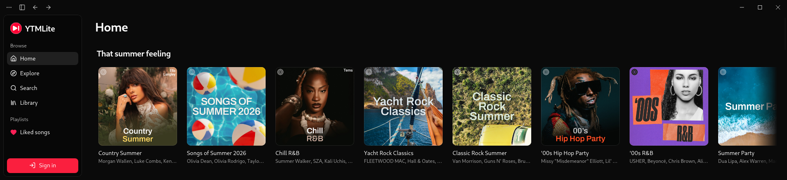

<p align="center">
  
</p>

<h1 align="center">YTMLite</h1>

<p align="center">
  YouTube Music with synced lyrics for the <b>Raspberry Pi 5</b> — built for a 1920×440 in-car display.
</p>

<p align="center">
  <a href="LICENSE"></a>
  
</p>

<p align="center">
  <a href="../../releases/latest">
    
  </a>
</p>

YTMLite is a **Raspberry Pi 5-only** build: a compact YouTube Music player that runs fullscreen on a 1920×440 in-car bar display, streams audio to the car over Bluetooth, and shows line-by-line synced lyrics with a timing knob to cancel Bluetooth latency. It talks to YouTube's InnerTube API directly and renders its own UI, so navigation and playback feel instant.



## Features

- **1920×440 in-car layout** — launches fullscreen and fills the short bar display; single bottom-bar player, no floating/side layouts
- **Synced lyrics** — line-by-line synced lyrics from multiple providers (LRCLIB, Musixmatch, Genius), sized to stay readable on the short screen
- **Lyrics timing offset** — a −3.0…+3.0 s knob (Settings → Lyrics Timing) that shifts the highlight to cancel the Bluetooth audio delay to the car speakers
- **Plays to the car over Bluetooth** — routes audio to the vehicle (e.g. a Tesla Model Y) via A2DP
- **Fast and responsive UI** — instant navigation with prefetch and aggressive caching; no page reloads, no spinners on every click
- **Hi-res cover art** — upgrades album covers to high-resolution studio art when available
- **Full library support** — your playlists, likes, albums and artists; search with filters; radio/autoplay queues
- **OS integration** — media keys and MPRIS on Linux
- **Auto-updates** — the app updates itself from GitHub Releases, and keeps its yt-dlp copy fresh automatically

> **Disclaimer:** YTMLite is an unofficial client. It is not affiliated with,
> endorsed by, or sponsored by Google or YouTube. "YouTube" and "YouTube Music"
> are trademarks of Google LLC. The app streams audio through
> [yt-dlp](https://github.com/yt-dlp/yt-dlp) and may stop working at any time if
> YouTube changes its internals. Use at your own risk.

## Install

YTMLite runs on a **Raspberry Pi 5** (8 GB recommended) on 64-bit Raspberry Pi
OS — it is not built for any other platform.

- Grab the latest `YTMLite_*_arm64.deb` from the [Releases](../../releases) page
  and install it: `sudo apt install ./YTMLite_*_arm64.deb`.
- On first launch the app downloads its own copy of yt-dlp (~12 MB) into its
  data folder and keeps it updated automatically.
- Sign in to Google **once** on first launch to load your library, likes, and
  playlists; the session is saved. Browse and playback also work anonymously.
- The app launches fullscreen for the in-car panel. Pair the Pi's Bluetooth to
  the car and set it as the default audio output.

### FAQ

**My antivirus flags the app / yt-dlp.**
yt-dlp is a widely-used open-source downloader that some AV vendors
false-positive on. The binary is downloaded directly from yt-dlp's official
GitHub releases.

**Will Google ban my account for using this?**
Browsing/search/library requests look identical to the official web app, and
audio streaming is fully anonymous (never tied to your account). There are no
known cases of accounts being banned for third-party players — but no
guarantees; see the disclaimer above.

**Playback suddenly stopped working.**
YouTube periodically changes its streaming internals. yt-dlp usually ships a
fix within days, and the app picks it up automatically (it self-updates its
yt-dlp copy every ~3 days). Restarting the app forces the check.

## Stack

- **Shell:** Tauri 2 (Rust backend, WebKitGTK system webview on Raspberry Pi OS)
- **Frontend:** React 19 + TypeScript
- **Build:** Vite 7
- **Styling:** Tailwind CSS v4
- **Components:** shadcn/ui (new-york style, neutral base, YouTube red accent)
- **Routing:** TanStack Router (file-based, type-safe, prefetch on intent)
- **Data:** TanStack Query
- **Client state:** Zustand
- **Icons:** lucide-react

## Dev

```bash
pnpm install
pnpm tauri dev
```

Frontend-only dev (no Tauri window): `pnpm dev`.

## Quality checks

```bash
pnpm test         # vitest unit tests (pure parsers/matchers)
pnpm lint         # eslint
pnpm format       # prettier --write
pnpm build        # tsc + vite production build
```

CI (`.github/workflows/ci.yml`) runs typecheck, lint, tests, the frontend
build and `cargo test` (Linux/arm64 only) on every push / PR. Releases build
the arm64 `.deb` on GitHub's hosted ARM runner (`.github/workflows/release.yml`).

## Project layout

```
src/
├── routes/              # TanStack Router file-based routes
├── components/
│   ├── ui/              # shadcn primitives
│   ├── layout/          # AppShell, sidebar, topbar, bottom player bar, lyrics
│   └── shared/          # Track list/rows, cards, shelves, context menus
├── lib/
│   ├── innertube/        # Raw InnerTube client + parsers
│   ├── lyrics/          # LRCLIB / Musixmatch / Genius sources + LRC parser
│   ├── store/           # Zustand stores
│   ├── audio-engine.ts  # Playback engine
│   ├── stream.ts        # Stream URL resolver (localhost proxy)
│   └── utils.ts         # cn() and friends
└── hooks/
src-tauri/               # Rust backend (axum stream proxy, cookies, tray)
```

## Credits

- **[YTubic](https://github.com/NUber-dev/YTubic) by George Shyshov** — YTMLite is
  a fork of YTubic, renamed and extended with the Raspberry Pi port. All of the
  original client is his work, used and redistributed under the GPL-3.0.
- [yt-dlp](https://github.com/yt-dlp/yt-dlp) — audio streaming
- [LRCLIB](https://lrclib.net) — synced lyrics
- Musixmatch and Genius — lyrics sources
- [Tauri](https://tauri.app), [shadcn/ui](https://ui.shadcn.com),
  [TanStack](https://tanstack.com), and the rest of the stack above

## License

[GPL-3.0](LICENSE) — free to use, modify, and redistribute; derivative works
must stay open source under the same license.
